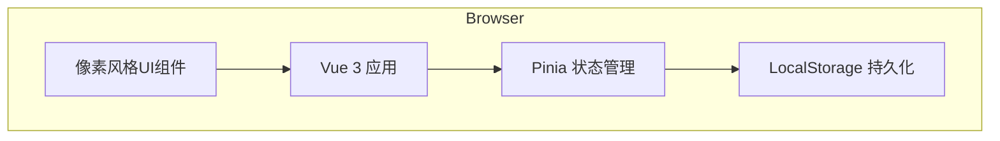

# RPGTodo 技术设计文档

Feature Name: rpgtodo-core
Updated: 2026-03-11

## Description

RPGTodo 是一个将 TODO 事项与 RPG 游戏任务面板相结合的单页 Web 应用。采用 Vue 3 + Vite 构建，使用 LocalStorage 进行数据持久化，以像素风格 UI 呈现游戏化任务管理体验。

## Architecture

### 系统架构图



### 技术栈

| 层级 | 技术选型 | 说明 |
|------|----------|------|
| 前端框架 | Vue 3 + Composition API | 响应式UI，组件化开发 |
| 构建工具 | Vite | 快速热更新，优化的生产构建 |
| 状态管理 | Pinia | Vue 官方推荐的状态管理库 |
| 路由 | Vue Router 4 | SPA 路由管理 |
| UI组件 | 自定义像素风格组件 | 手写CSS实现像素风 |
| 图标/动画 | CSS Sprites + CSS Animation | 像素风格动画效果 |
| 数据持久化 | LocalStorage | 浏览器本地存储 |
| 语言 | TypeScript | 类型安全 |

### 目录结构

```
rpgtodo/
├── index.html
├── package.json
├── tsconfig.json
├── vite.config.ts
├── src/
│   ├── main.ts                 # 应用入口
│   ├── App.vue                 # 根组件
│   ├── assets/                 # 静态资源
│   │   ├── fonts/              # 像素字体
│   │   ├── sprites/            # 精灵图
│   │   └── styles/             # 全局样式
│   │       ├── main.css        # 主样式
│   │       ├── pixel-ui.css    # 像素风UI组件样式
│   │       └── animations.css  # 动画效果
│   ├── components/             # 组件
│   │   ├── common/             # 通用组件
│   │   │   ├── PixelButton.vue
│   │   │   ├── PixelCard.vue
│   │   │   ├── PixelModal.vue
│   │   │   ├── PixelInput.vue
│   │   │   └── PixelProgressBar.vue
│   │   ├── task/               # 任务相关组件
│   │   │   ├── TaskCard.vue
│   │   │   ├── TaskList.vue
│   │   │   ├── TaskForm.vue
│   │   │   ├── TaskDetail.vue
│   │   │   └── SubtaskItem.vue
│   │   ├── character/          # 角色相关组件
│   │   │   ├── CharacterPanel.vue
│   │   │   ├── CharacterAvatar.vue
│   │   │   ├── LevelBar.vue
│   │   │   └── Inventory.vue
│   │   ├── boss/               # Boss战组件
│   │   │   ├── BossBattle.vue
│   │   │   └── BattleResult.vue
│   │   └── layout/             # 布局组件
│   │       ├── Header.vue
│   │       ├── Sidebar.vue
│   │       └── MainLayout.vue
│   ├── views/                  # 页面视图
│   │   ├── HomeView.vue        # 首页/任务列表
│   │   ├── CharacterView.vue   # 角色页面
│   │   ├── BossView.vue        # Boss战页面
│   │   └── SettingsView.vue    # 设置页面
│   ├── stores/                 # Pinia stores
│   │   ├── taskStore.ts        # 任务状态
│   │   ├── characterStore.ts   # 角色状态
│   │   └── settingsStore.ts    # 设置状态
│   ├── services/               # 业务服务
│   │   ├── storageService.ts   # LocalStorage封装
│   │   ├── rewardService.ts    # 奖励计算
│   │   └── battleService.ts    # Boss战逻辑
│   ├── types/                  # TypeScript类型
│   │   ├── task.ts
│   │   ├── character.ts
│   │   └── common.ts
│   ├── utils/                  # 工具函数
│   │   ├── dateUtils.ts
│   │   └── randomUtils.ts
│   └── router/
│       └── index.ts            # 路由配置
└── public/
    └── favicon.ico
```

## Components and Interfaces

### 核心组件

#### TaskCard 组件

```typescript
interface TaskCardProps {
  task: Task
  showSubtasks?: boolean
}

interface TaskCardEmits {
  (e: 'complete', taskId: string): void
  (e: 'edit', taskId: string): void
  (e: 'delete', taskId: string): void
}
```

#### CharacterPanel 组件

```typescript
interface CharacterPanelProps {
  character: Character
}

interface CharacterPanelEmits {
  (e: 'openInventory'): void
  (e: 'openEquipment'): void
}
```

#### BossBattle 组件

```typescript
interface BossBattleProps {
  battleData: BattleData
}

interface BossBattleEmits {
  (e: 'start'): void
  (e: 'finish'): void
}
```

### Pinia Store 接口

#### TaskStore

```typescript
interface TaskState {
  tasks: Task[]
  loading: boolean
  error: string | null
}

interface TaskActions {
  fetchTasks(): Promise<void>
  createTask(task: CreateTaskDTO): Promise<Task>
  updateTask(id: string, updates: UpdateTaskDTO): Promise<Task>
  deleteTask(id: string): Promise<void>
  completeTask(id: string): Promise<RewardResult>
  addSubtask(parentId: string, subtask: CreateTaskDTO): Promise<Task>
  resetDailyTasks(): Promise<void>
  resetWeeklyTasks(): Promise<void>
}
```

#### CharacterStore

```typescript
interface CharacterState {
  character: Character | null
  loading: boolean
}

interface CharacterActions {
  initCharacter(): Promise<void>
  addExperience(amount: number): Promise<void>
  addGold(amount: number): Promise<void>
  levelUp(): Promise<void>
  purchaseItem(itemId: string): Promise<boolean>
  equipItem(itemId: string): Promise<void>
}
```

## Data Models

### Task 任务模型

```typescript
interface Task {
  id: string
  title: string
  description: string
  difficulty: TaskDifficulty
  type: TaskType
  status: TaskStatus
  reward: Reward
  deadline: string | null
  parentTaskId: string | null
  subtaskIds: string[]
  createdAt: string
  updatedAt: string
  completedAt: string | null
}

type TaskDifficulty = 'easy' | 'normal' | 'hard' | 'epic' | 'legendary'
type TaskType = 'daily' | 'weekly' | 'custom'
type TaskStatus = 'pending' | 'in_progress' | 'completed' | 'failed'

interface Reward {
  experience: number
  gold: number
  items?: string[]
}
```

### Character 角色模型

```typescript
interface Character {
  id: string
  name: string
  level: number
  experience: number
  experienceToNextLevel: number
  gold: number
  equipment: Equipment
  inventory: InventoryItem[]
  stats: CharacterStats
  createdAt: string
}

interface Equipment {
  weapon: string | null
  armor: string | null
  accessory: string | null
}

interface CharacterStats {
  totalTasksCompleted: number
  totalRewardsEarned: Reward
  longestStreak: number
  currentStreak: number
}
```

### Boss Battle 模型

```typescript
interface BossBattle {
  id: string
  boss: Boss
  playerDamage: number
  status: BattleStatus
  startTime: string
  endTime: string | null
  result: BattleResult | null
}

interface Boss {
  id: string
  name: string
  maxHp: number
  currentHp: number
  spriteUrl: string
}

interface BattleResult {
  victory: boolean
  totalDamageDealt: number
  tasksCompleted: number
  rewardsEarned: Reward
}

type BattleStatus = 'pending' | 'active' | 'completed'
```

### 奖励计算规则

| 难度 | 经验值 | 金币 |
|------|--------|------|
| easy | 10 | 5 |
| normal | 25 | 15 |
| hard | 50 | 30 |
| epic | 100 | 60 |
| legendary | 200 | 120 |

### 升级经验公式

```
experienceToNextLevel = 100 * level * level
```

## Correctness Properties

### 数据一致性

1. 子任务的父ID必须存在于任务列表中
2. 任务完成时，所有子任务必须已完成
3. 角色经验值不能为负数
4. 金币数量不能为负数

### 业务规则

1. 每日任务在每天 00:00 重置状态
2. 每周任务在每周一 00:00 重置状态
3. Boss战每周结算一次
4. 删除父任务必须同时删除所有子任务

### UI约束

1. 任务列表按截止时间排序，已过期任务显示警告
2. 角色等级上限为 99
3. 单个任务最多嵌套 3 层子任务

## Error Handling

### 错误类型

```typescript
enum AppError {
  STORAGE_QUOTA_EXCEEDED = 'STORAGE_QUOTA_EXCEEDED',
  TASK_NOT_FOUND = 'TASK_NOT_FOUND',
  INVALID_TASK_DATA = 'INVALID_TASK_DATA',
  CHARACTER_NOT_INITIALIZED = 'CHARACTER_NOT_INITIALIZED',
  INSUFFICIENT_GOLD = 'INSUFFICIENT_GOLD',
}
```

### 错误处理策略

| 错误类型 | 处理方式 |
|----------|----------|
| STORAGE_QUOTA_EXCEEDED | 提示用户清理旧任务，尝试压缩数据 |
| TASK_NOT_FOUND | 返回任务列表页，显示提示消息 |
| INVALID_TASK_DATA | 显示表单验证错误，阻止提交 |
| INSUFFICIENT_GOLD | 显示金币不足提示，禁止购买 |

## Test Strategy

### 单元测试

- 使用 Vitest 作为测试框架
- 测试覆盖所有 Store 的 actions 和 getters
- 测试奖励计算、经验值计算等核心逻辑
- 测试任务状态转换逻辑

### 组件测试

- 使用 @vue/test-utils 测试组件渲染
- 测试用户交互（点击、输入、拖拽）
- 测试组件间通信

### 集成测试

- 测试 LocalStorage 数据持久化
- 测试完整任务创建流程
- 测试 Boss 战结算流程

### E2E 测试

- 使用 Playwright 进行端到端测试
- 测试用户完整使用场景
- 测试跨浏览器兼容性

## Implementation Phases

### Phase 1: 基础框架 (第1-2天)

1. 初始化 Vue 3 + Vite + TypeScript 项目
2. 配置 Pinia、Vue Router
3. 实现像素风格基础 UI 组件
4. 实现 LocalStorage 服务

### Phase 2: 任务管理 (第3-4天)

1. 实现 Task 数据模型和 Store
2. 实现任务列表、创建、编辑、删除功能
3. 实现任务嵌套功能
4. 实现任务类型（每日/每周/自定义）

### Phase 3: 角色系统 (第5-6天)

1. 实现 Character 数据模型和 Store
2. 实现角色面板 UI
3. 实现奖励计算和发放
4. 实现升级系统

### Phase 4: Boss战系统 (第7天)

1. 实现 Boss 战逻辑
2. 实现 Boss 战 UI 和动画
3. 实现结算统计

### Phase 5: 优化与完善 (第8天)

1. 添加动画效果和音效
2. 性能优化
3. 响应式适配
4. 测试和修复 Bug
